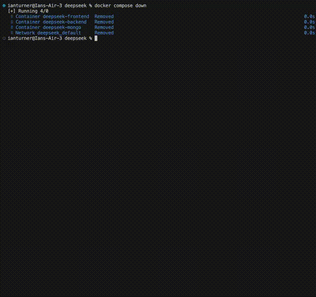

# CalendarMedia
CalendarMedia is a unique social web app designed to help users connect through shared events. Instead of focusing on just posts and photos like a more conventional social media, CalendarMedia centers around a user's calendar and their events. This allows the user to discover and share events that friends or nearby users are attending. With CalendarMedia, users can easily create and customize their own events and invite others to join them. The app features an interface where individuals can explore local happenings, from casual gatherings to community festivals. Users can also follow friends to stay updated on their activities. By prioritizing events over traditional social media content, CalendarMedia encourages real-world interactions and helps users make the most of their lives outside of other apps that facilitate exclusively online interaction.

## Development Environment

### About
The dev environment uses [Docker Compose](https://docs.docker.com/compose/)
to start a python server, javascript frontend, and mongodb database.
It creates Docker containers and installs the required packages into
those containers so that all developers will be using the same versions.

### Setup
1. Install and start [Docker](https://docs.docker.com/engine/install/)
2. Clone the repository and navigate to the project directory
3. Run the command `docker compose up`
    - Alternatively, run `docker compose up -d` to start without attaching
    and then run `docker compose logs --follow` to attach to logs
4. To stop the environment press `Ctrl-C` in the terminal
5. To clean the environment run the command `docker system prune -af`
    - Do this to fix any environment issues or after changing package requirements

### Testing
1. Make sure docker container is running
2. Enter the command `docker exec -it deepseek-frontend npx vitest` to test the frontend
    - Testing folder is located at frontend/src/\_\_tests\_\_
3. Enter the command `sh scripts/test_backend.sh` to test the backend
   

4. The project includes automated Selenium tests located in the `/testing` directory. These tests cover core functionality like user registration, login, event creation, and friend management.

#### Requirements
- Python 3.x
- Firefox browser installed
- Virtual environment (recommended)

#### Running the Tests

**Windows (PowerShell)**
```powershell
cd testing
.\run_tests.ps1
```

**Linux/MacOS**
```bash
cd testing
chmod +x run_tests.sh
./run_tests.sh
```

#### Available Tests
- `test_register.py` - Tests user registration
- `test_registerlogin.py` - Tests registration and login flow with error cases
- `test_createevent.py` - Tests event creation functionality
- `test_profileflow.py` - Tests profile management features
- `test_addfriend.py` - Tests friend request and acceptance flow

### Resources
- [Docker guide](https://docs.docker.com/get-started/docker-overview/)
- [React guide](https://react.dev/)
- [Unit testing in Flask](https://www.digitalocean.com/community/tutorials/unit-test-in-flask)

## Deployment

The app is currently deployed on a [DigitalOcean](https://digitalocean.com) virtual machine.
The ReactJS files are being served statically and the backend is being served through
a docker container over a reverse proxy using [Nginx](https://nginx.org/).

### Docker

Install and start Docker using their [guide](https://docs.docker.com/engine/install/ubuntu/)

### MongoDB

1. Install and start MongoDB using their [guide](https://www.mongodb.com/docs/manual/tutorial/install-mongodb-on-ubuntu/)

2. Create a text index for the users collection using

    ```
    db = new Mongo().getDB('appdb')
    db.createCollection('users')
    db.users.createIndex({username: 'text', name: 'text', bio: 'text'})
    ```

### Nginx

Source: [How To Configure Nginx as a Reverse Proxy](https://www.digitalocean.com/community/tutorials/how-to-configure-nginx-as-a-reverse-proxy-on-ubuntu-22-04)

Note: replace `SERVER_HOSTNAME` with the hostname of the deployment server, e.g.
`app.example.com`

Note: some commands may need to be run using `sudo` if you are not the root user

1. Update system and install Nginx

    ```
    apt update
    apt upgrade -y
    apt install nginx -y
    ```

2. Create backend config file (`/etc/nginx/sites-available/api.SERVER_HOSTNAME`):

    ```
    server {
            listen 80;
            listen [::]:80;

            server_name api.SERVER_HOSTNAME;

            location / {
                    proxy_pass http://localhost:5000/;
                    include proxy_params;
            }
    }
    ```

3. Create frontend config file (`/etc/nginx/sites-available/SERVER_HOSTNAME`):

    ```
    server {
            listen 80;
            listen [::]:80;

            server_name SERVER_HOSTNAME;
            location / {
                root /usr/local/deepseek-frontend;
                try_files $uri /index.html;
            }
    }
    ```

4. Enable sites by linking

    ```
    ln -s /etc/nginx/sites-available/api.SERVER_HOSTNAME /etc/nginx/sites-enabled/
    ln -s /etc/nginx/sites-available/SERVER_HOSTNAME /etc/nginx/sites-enabled/
    ```

5. Check Nginx config

    ```
    nginx -t
    ```

6. Restart Nginx
   
   ```
   systemctl restart nginx
   ```

### HTTPS certification

Source: [Certbot instructions](https://certbot.eff.org/instructions?ws=nginx&os=ubuntufocal)

1. Install Certbot
   
   ```
   snap install --classic certbot
   ln -s /snap/bin/certbot /usr/bin/certbot
   ```

2. Create certificate and modify Nginx config

    ```
    certbot --nginx
    ```

3. Check config and restart Nginx as described in steps 5-6 of the previous section

### Firewall

Source: [How to Set Up a Firewall with UFW on Ubuntu](https://www.digitalocean.com/community/tutorials/how-to-set-up-a-firewall-with-ufw-on-ubuntu)

1. Allow SSH and HTTPS connections
   
   ```
   ufw allow OpenSSH
   ufw allow Nginx HTTPS
   ```

2. Enable firewall
   
   ```
   ufw enable
   ```

### Deployment script

To deploy the website, run `sh scripts/deploy.sh`

## Authors
- Tristan Shillingford (trshillingford@gmail.com)
- Jacob Robertson (jacobr10183@gmail.com)
- Dominic Colin Gaines (dcolingaines@gmail.com)
- Ian Turner (i.r.turner55@gmail.com)
- Joe Zelinsky (jzelinsky1818@gmail.com)
